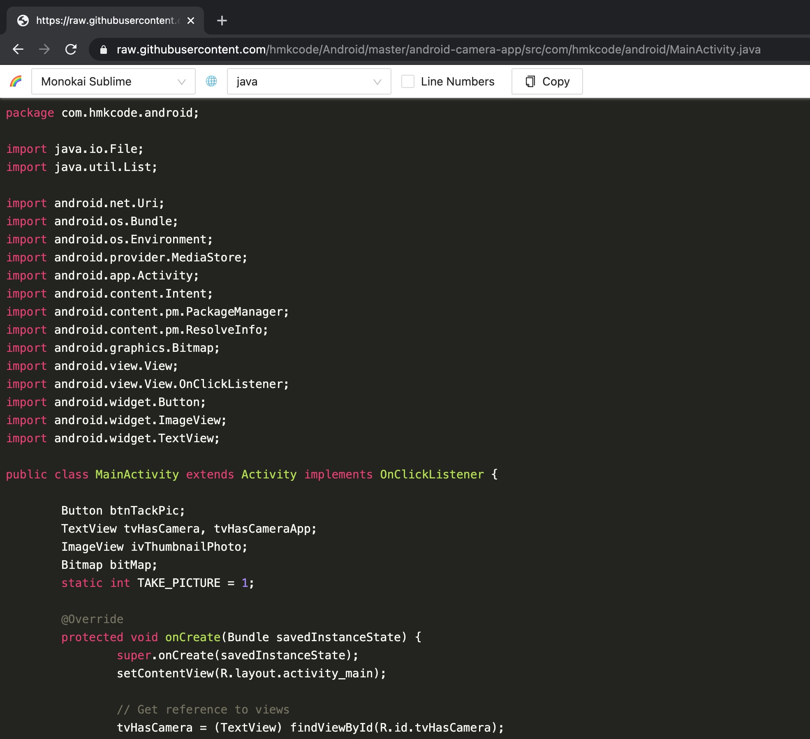

# Chrome Extension Code Highlighter

## Features

* Support 191 languages, such as `json` `yaml` `java` ...
* Support 97 themes
* Automatically detect languages
* Automatically detect all plain text content, such as `GitHub` and `GitLab` raw content.

## Dependent

* [create-react-chrome-extension-ts](https://github.com/pixochi/create-react-chrome-extension-ts)
* [react-syntax-highlighter](https://github.com/react-syntax-highlighter/react-syntax-highlighter) with [highlightjs.org](https://highlightjs.org/)
* [ant.design](https://ant.design/)

## Available Scripts

In the project directory, you can run:

### `yarn start`

Runs the app in the development mode.\
Open [http://localhost:3000](http://localhost:3000) to view it in the browser.

The page will reload if you make edits.\
You will also see any lint errors in the console.

### `yarn build:extension`

**Builds the extension** for production to the `build` folder.\
It correctly bundles React in production mode and optimizes the build for the best performance.

The build is minified and your extension is ready to be used in Developer mode or published to the Google Web Store!.

#### Open the extension in Developer mode

1. Open the Extension Management page by navigating to [chrome://extensions](chrome://extensions).
2. Enable Developer Mode by clicking the toggle switch next to **Developer mode**.
3. Click the **LOAD UNPACKED** button and select the extension directory.

### `yarn build:web-app`

**Builds the web app** for production to the `build` folder.\
It correctly bundles React in production mode and optimizes the build for the best performance.

The build is minified and the filenames include the hashes.\
Your app is ready to be deployed!

See the section about [deployment](https://facebook.github.io/create-react-app/docs/deployment) for more information.

### `yarn test`

Launches the test runner in the interactive watch mode.\
See the section about [running tests](https://facebook.github.io/create-react-app/docs/running-tests) for more information.

## Learn More

You can read more in the Medium article: [How to Build a Chrome Extension with React, TypeScript and Webpack: From creating a boilerplate to publishing a complete extension to Chrome Web Store](https://jakub-kozak.medium.com/how-to-build-a-chrome-extension-with-react-typescript-and-webpack-92e806ce2e16).

